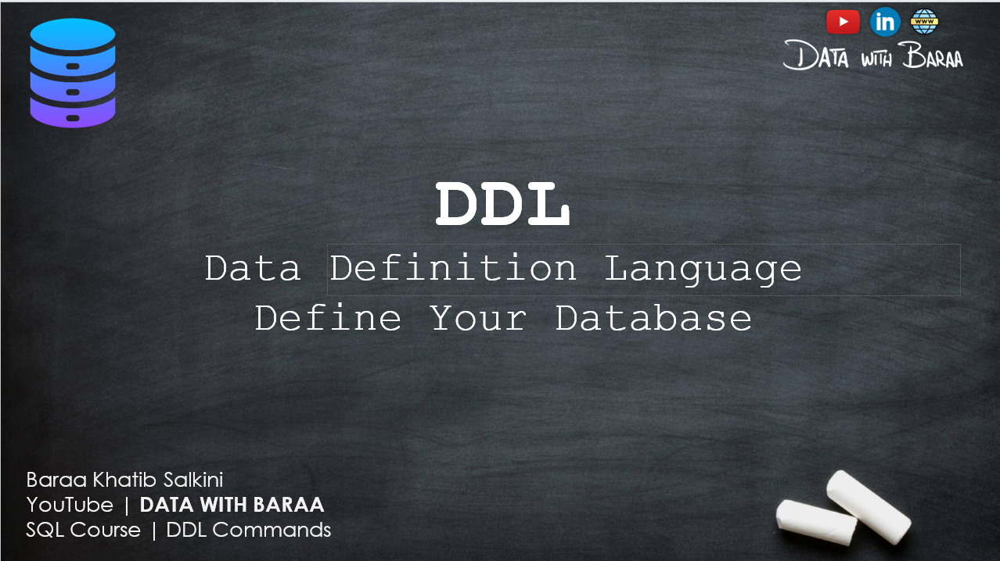

# 📘 SQL DDL (Data Definition Language)

SQL DDL (Data Definition Language) is a subset of SQL used to define and manage **database structures** such as tables, schemas, indexes, and views.

---

## 🧱 What is DDL?

DDL stands for **Data Definition Language**. It includes SQL commands that define the **structure** of the database and its objects, but it does **not manage the data itself** (use DML for that).

---
# INTRODUCTION OF SQL DDL

## 🖼️ Overview Image



## 🧠 What You’ll Learn
-  what is DDL in SQL


## 🚀 How to Use

1. Open your SQL IDE (MySQL Workbench, SQLite, pgAdmin, etc.)
2. Clone this repo:
   ```bash
   git clone https://github.com/sdSAHABUDDIN/SQL.git
   cd DDL


