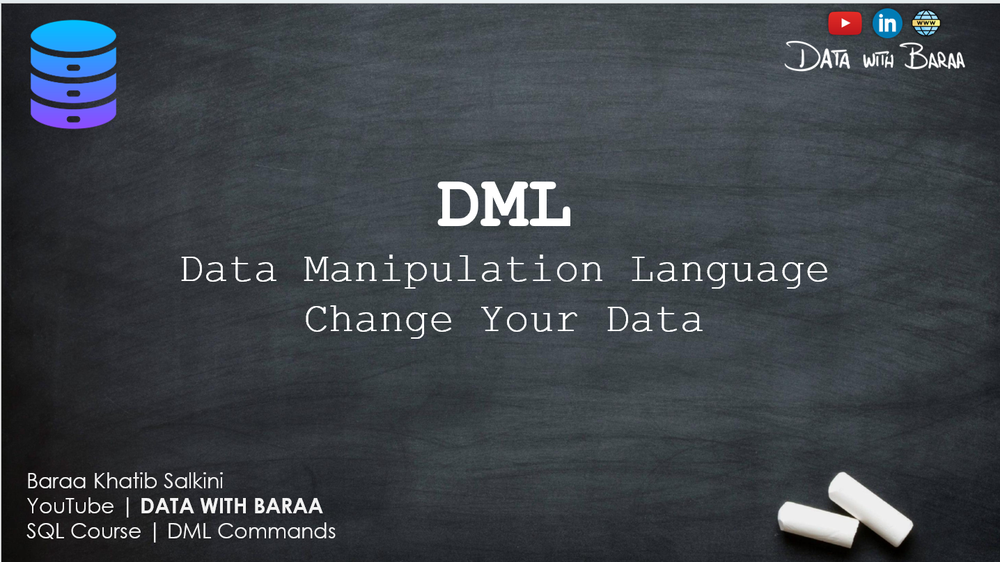
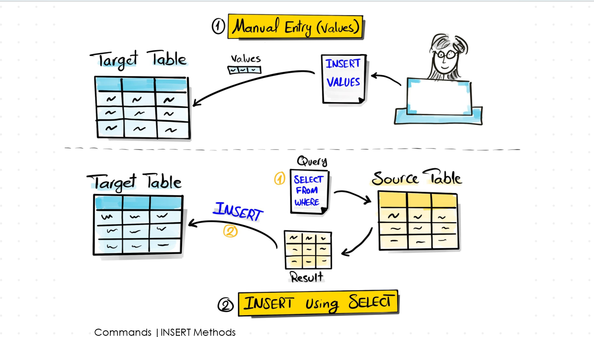
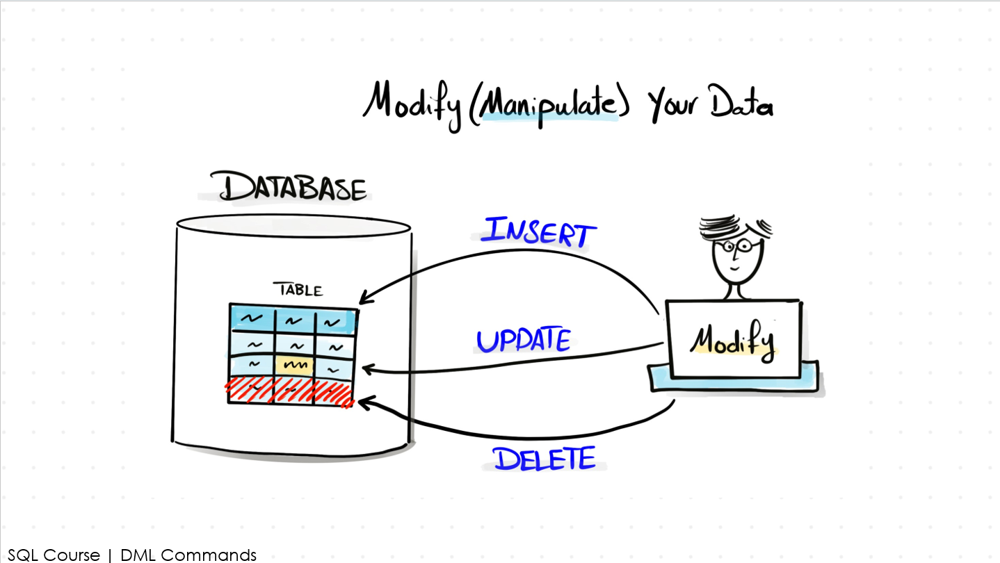

# 📘 SQL DML (Data Manipulation Language)

**DML (Data Manipulation Language)** is a core subset of SQL used to **interact with and manage data** stored in database tables.

While DDL (Data Definition Language) defines the structure of a database, **DML is used to perform operations on the data itself** — such as inserting, retrieving, updating, and deleting records.

---

# INTRODUCTION OF DML

## 🖼️ Overview Image



## 🧠 What You’ll Learn
-  what is DML 
-  Why we use DML

# INSERT COMMAND

## 🖼️ Overview Image



## 🧠 What You’ll Learn
-  Adds new data into a table

# UPDATE COMMAND

## 🖼️ Overview Image



## 🧠 What You’ll Learn
-  Modifies existing data in a table

# DELETE COMMAND

## 🖼️ Overview Image


## 🧠 What You’ll Learn
-  Removes data from a table


## 🚀 How to Use

1. Open your SQL IDE (MySQL Workbench, SQLite, pgAdmin, etc.)
2. Clone this repo:
   ```bash
   git clone https://github.com/sdSAHABUDDIN/SQL.git
   cd DML