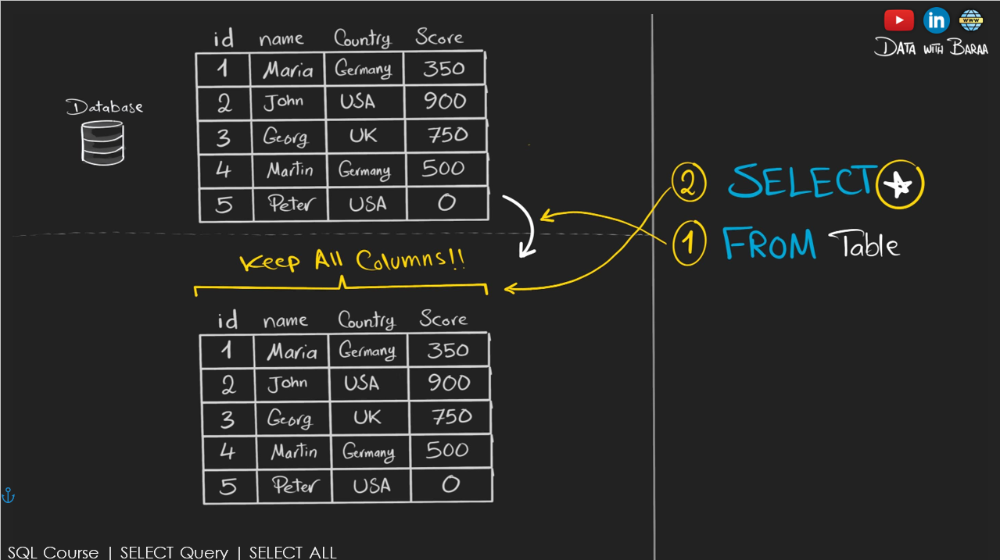
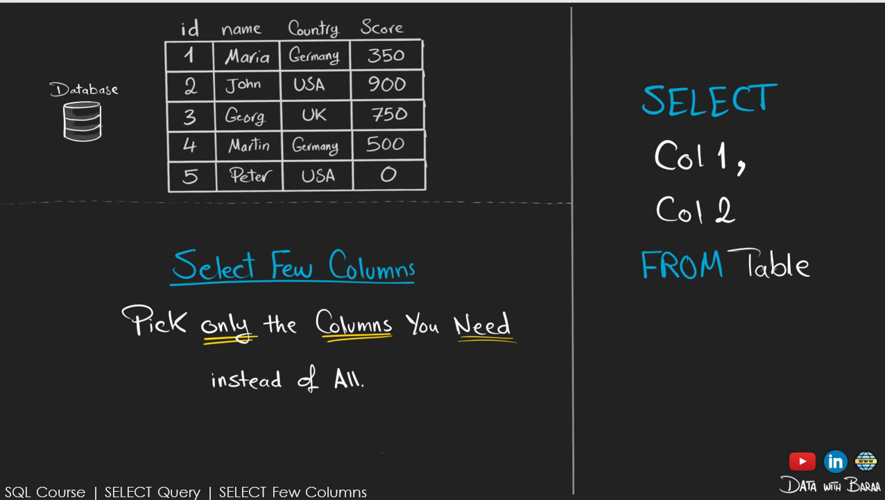
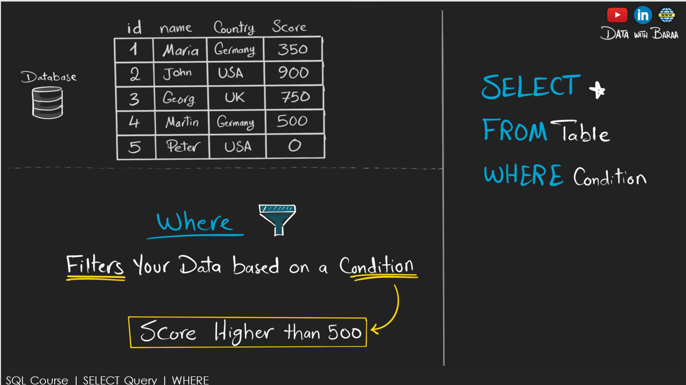
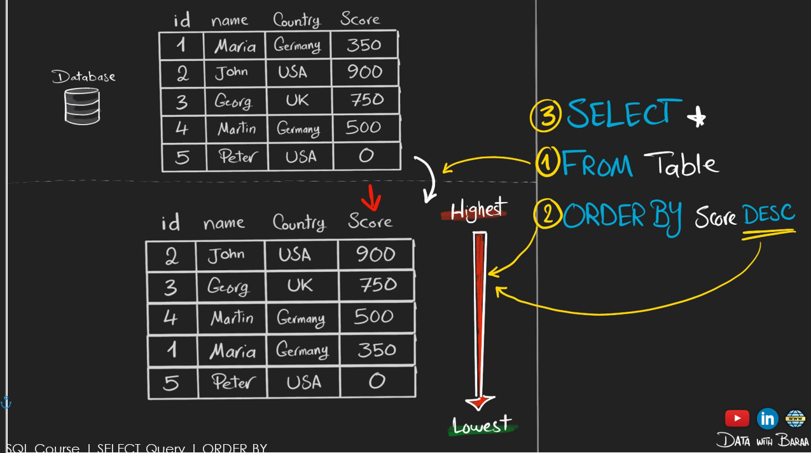
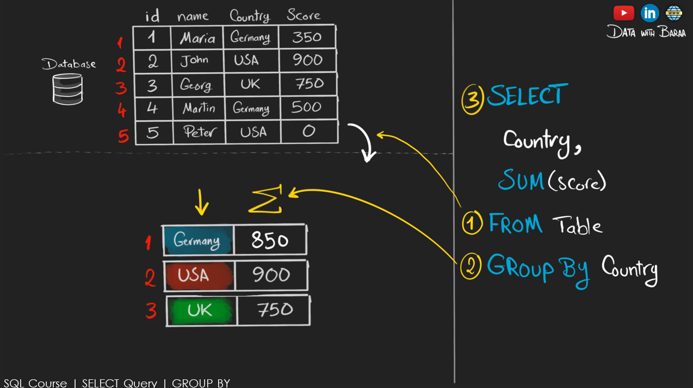
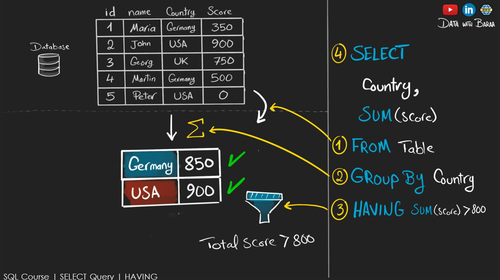
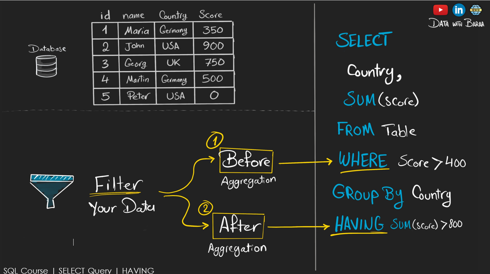
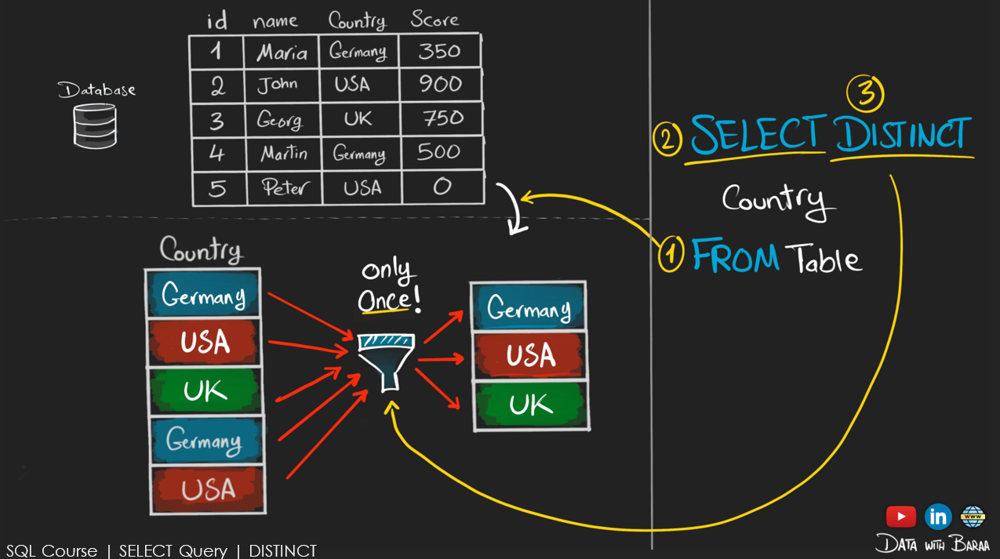
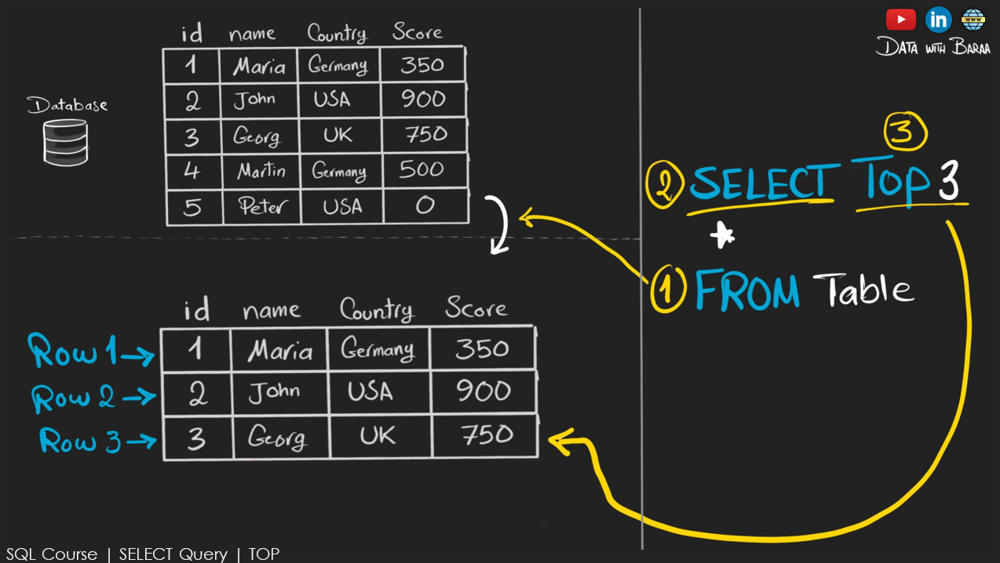

# 📊 SQL DQL Command Practice

This repository contains various practice queries and explanations using the `DQL` command in SQL. It's great for beginners looking to strengthen their SQL fundamentals.

## 🖼️ Overview Image
# SELECT
## RETRIVE ALL CUSTOMER DATA FROM CUSTOMER TABLE


## 🧠 What You’ll Learn

- Basic SELECT syntax  

# SELECT column name
## RRETRIVE ALL CUSTOMER first name and country FROM CUSTOMER TABLE

## 🖼️ Overview Image



## 🧠 What You’ll Learn
- Basic SELECT syntax with specific column name
-  Pick only the columns you need instead of all.

# WHRE COMMAND
## --RETRIVE CUSTOMERS WITH A SCORE > 500

## 🖼️ Overview Image



## 🧠 What You’ll Learn

-  Filters your data based on condition
# ORDER BY COMMAND
## --Retrive customer and sort the result by the highest score

## 🖼️ Overview Image



## 🧠 What You’ll Learn
-  Sort your data ascending or descending order 
-  You can use nested ORDER also
# GROUP BY COMMAND
## --Find the total score of each country if you want to change output column name as total_score

## 🖼️ Overview Image



## 🧠 What You’ll Learn
-  Combines rows with the same value. 
-  Aggregates a column by anothre column.

# HAVING COMMAND
## --Find the total score of each country where total_score must be greather than 800

## 🖼️ Overview Image



## 🧠 What You’ll Learn
-  Filter data after aggregation can be used only with GROUP BY 

# Diff  b/w HAVING and WHERE
## --Find the total score of each country where total_score must be greather than 800

## 🖼️ Overview Image



## 🧠 What You’ll Learn
-  Filter data after aggregation can be used only with GROUP BY.

# DISTINCT COMMAND

## --Return unique list of all countries

## 🖼️ Overview Image



## 🧠 What You’ll Learn
-  Remove duplicates each value appears only once

# TOP COMMAND

## --RETRIVE ONLY 3 CUSTOMERS

## 🖼️ Overview Image



## 🧠 What You’ll Learn
-  Restict the number of rows returned
## 🚀 How to Use

1. Open your SQL IDE (MySQL Workbench, SQLite, pgAdmin, etc.)
2. Clone this repo:
   ```bash
   git clone https://github.com/sdSAHABUDDIN/SQL.git
   cd DQL
