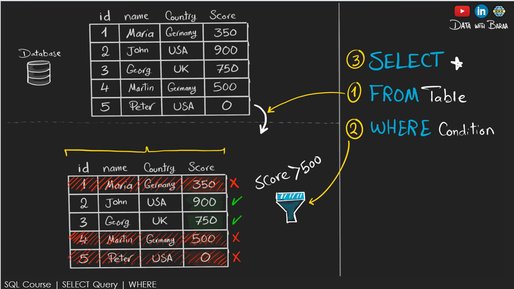

# 📊 SQL SELECT Command Practice

This repository contains various practice queries and explanations using the `DQL` command in SQL. It's great for beginners looking to strengthen their SQL fundamentals.

## 🖼️ Overview Image
# RETRIVE ALL CUSTOMER DATA FROM CUSTOMER TABLE


## 🧠 What You’ll Learn

- Basic SELECT syntax  

# RRETRIVE ALL CUSTOMER first name and country FROM CUSTOMER TABLE

## 🖼️ Overview Image


## 🧠 What You’ll Learn

-  Pick only the columns you need instead of all.

# --RETRIVE CUSTOMERS WITH A SCORE > 500

## 🖼️ Overview Image



## 🧠 What You’ll Learn

-  Filters your data based on condition

## 🚀 How to Use

1. Open your SQL IDE (MySQL Workbench, SQLite, pgAdmin, etc.)
2. Clone this repo:
   ```bash
   git clone https://github.com/sdSAHABUDDIN/SQL.git
   cd DQL
