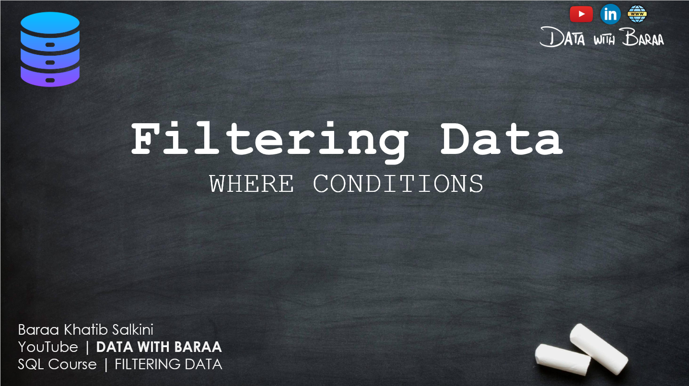
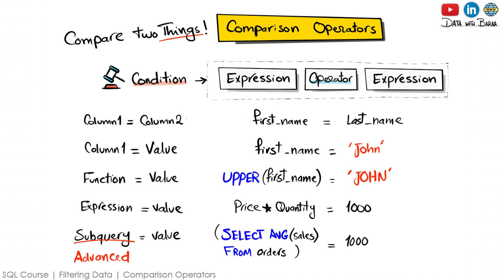
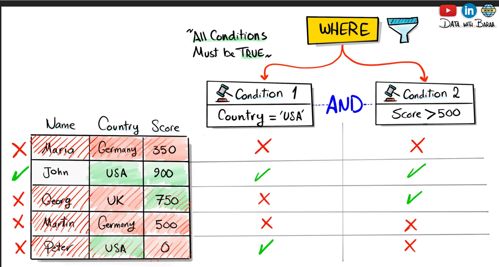
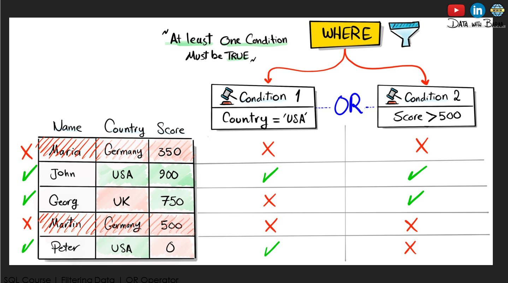
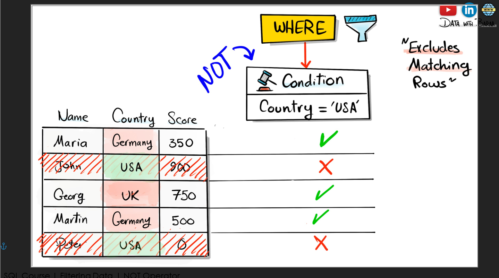
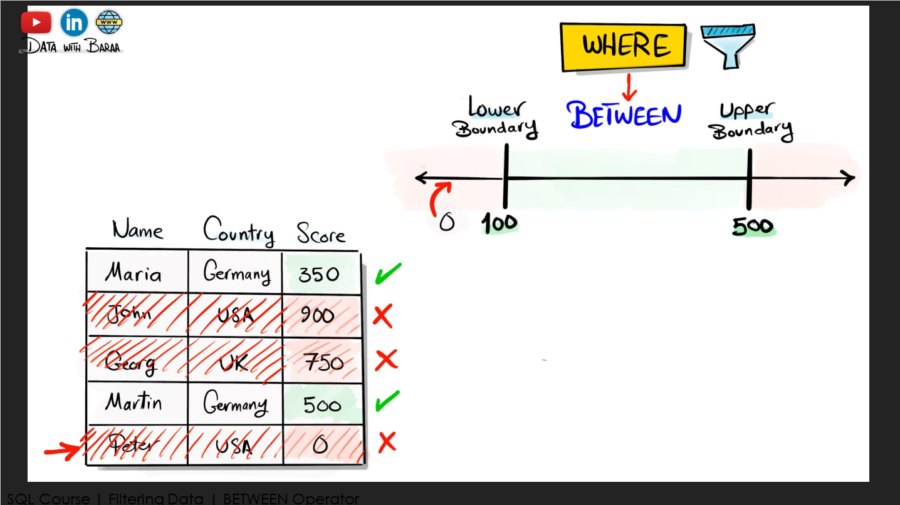
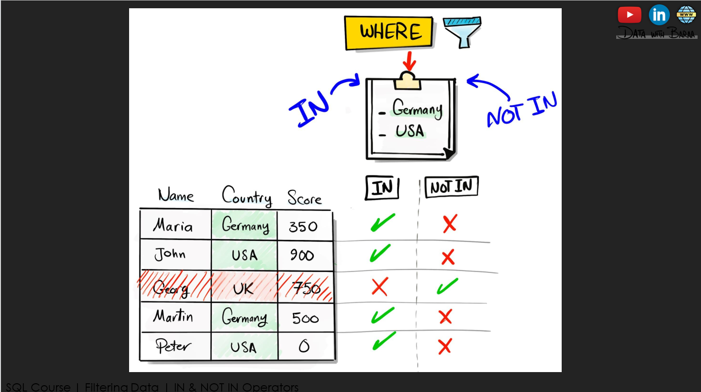
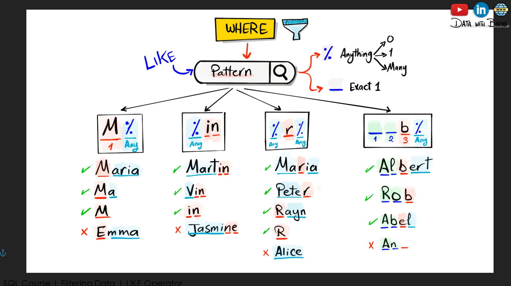

# 🧪 SQL Filtering Data – Practice and Examples

This repository contains detailed SQL query examples focused on filtering data using **Comparison**, **Logical**, **Range**, **Membership**, and **Search** operators. This is ideal for beginners and intermediate learners who want to master data filtering in SQL.

---
## 🖼️ Overview Image



## 📘 Concepts Covered

### 1. 🔍 Comparison Operators
Used to compare column values.
- `=`, `!=`, `<>`, `<`, `>`, `<=`, `>=`

**Example:**
## 🖼️ Overview Image




### 2. 🔍 Logical Operators
Used to compare column values.
- `AND`, `OR`, `NOT`

**Example:**
## 🖼️ Overview Image





### 3. 🔍 Range Operators
Check if a value is with in a range.
- `BETWEEN`

**Example:**
## 🖼️ Overview Image



### 4. 🔍 MemberShip Operators
Check value exists or not.
- `IN`, `NOT IN`

**Example:**
## 🖼️ Overview Image



### 4. 🔍 Search Operators
Search for a pattern in text.
- `LIKE`

**Example:**
## 🖼️ Overview Image



## 🚀 How to Use

1. Open your SQL IDE (MySQL Workbench, SQLite, pgAdmin, etc.)
2. Clone this repo:
   ```bash
   git clone https://github.com/sdSAHABUDDIN/SQL.git
   cd FILTERING