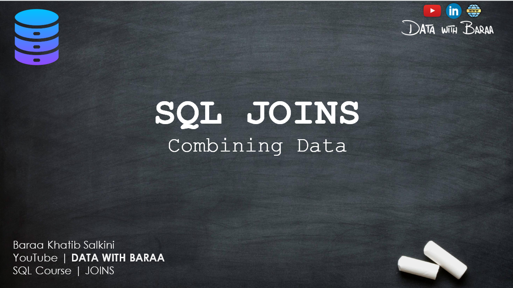
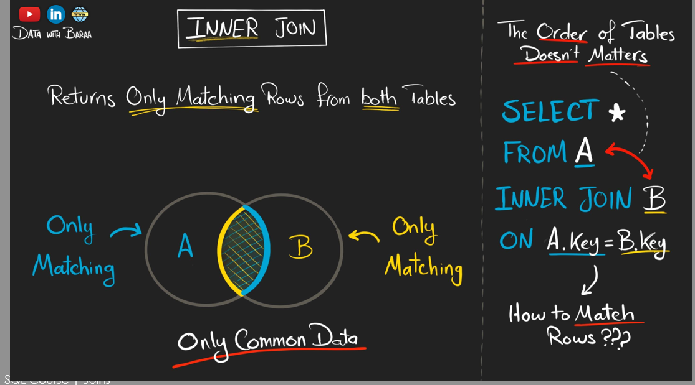
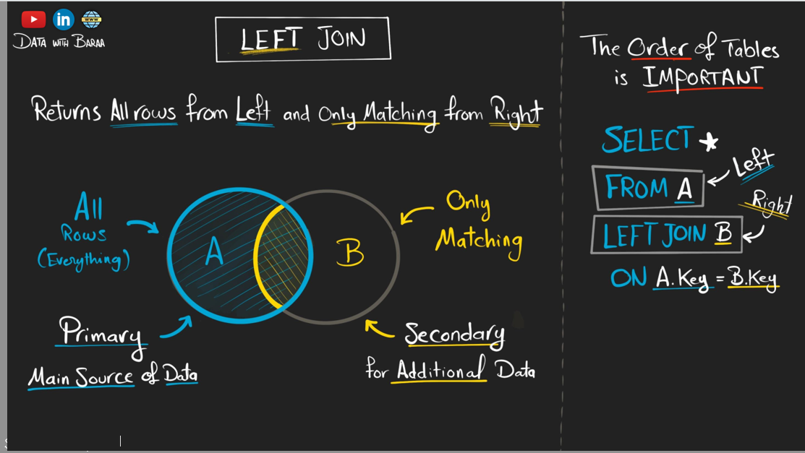
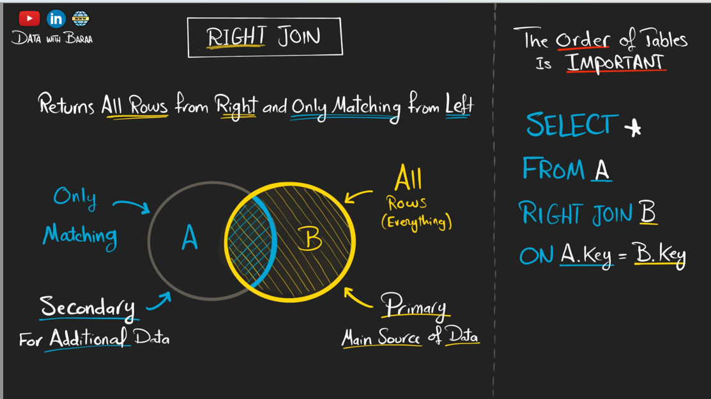
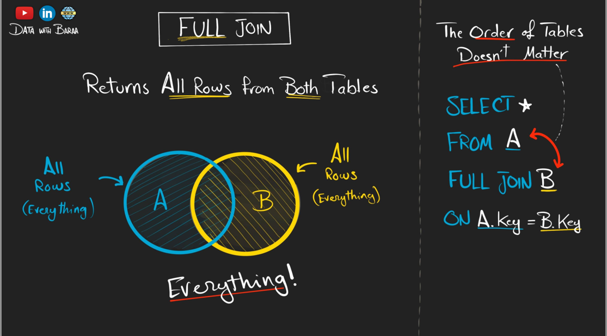
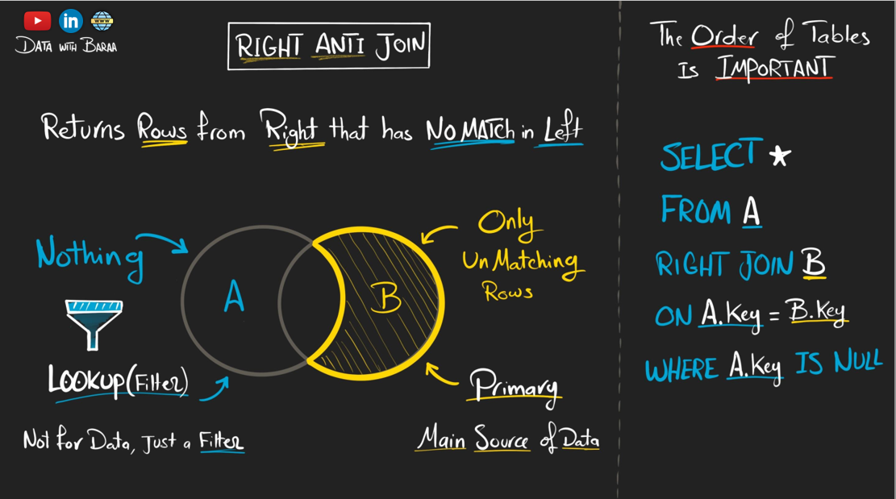
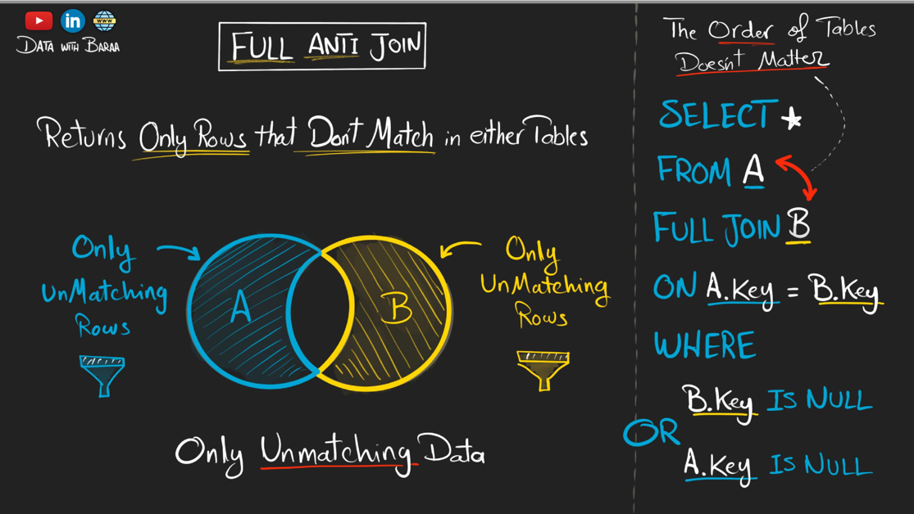
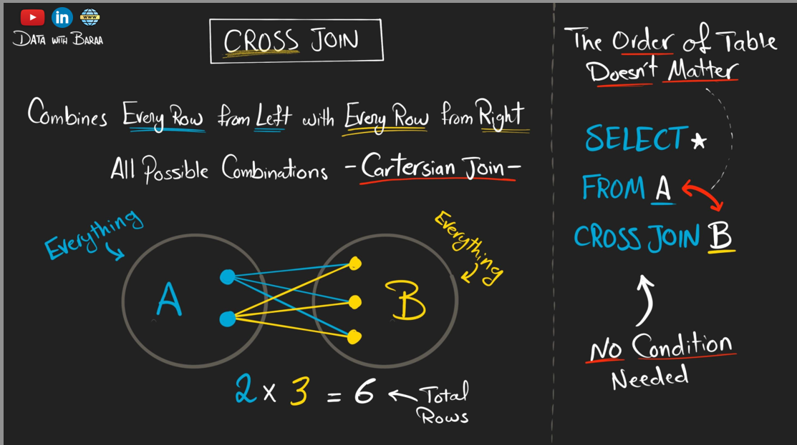

## 🔗 Introduction to SQL JOINs
 To retrieve meaningful and complete information, we need to combine data from these related tables — and that's where **SQL JOINs** come into play.

### 🔍 JOIN 

**Example:**
## 🖼️ Overview Image



SQL JOINs allow you to link rows from two or more tables based on a related column between them, typically a primary key and foreign key relationship.

### 1. 🔍 INNER JOIN
--retrieves only matching rows from both tables

**Example:**
## 🖼️ Overview Image



By understanding JOINs deeply, you’ll be able to write efficient queries that connect complex datasets — a must-have skill for data analysis, backend development, and database design.

### 2. 🔍 LEFT JOIN
--Return all rows from left and only matching from right

**Example:**
## 🖼️ Overview Image



### 3. 🔍 RIGHT JOIN
--Return row from right that has no match in left

**Example:**
## 🖼️ Overview Image



### 4. 🔍 FULL JOIN
--Return all row from both tables

**Example:**
## 🖼️ Overview Image



### 5. 🔍 LEFT ANTI JOIN
--Return row from left that has no match in right

**Example:**
## 🖼️ Overview Image


### 6. 🔍 RIGHT ANTI JOIN
--Return row from right that has no match in left

**Example:**
## 🖼️ Overview Image




### 7. 🔍 FULL ANTI JOIN
--Return row  has don't match in entire table

**Example:**
## 🖼️ Overview Image



### 8. 🔍 CROSS JOIN
--combines every row from left with every row from right all possible combinations

**Example:**
## 🖼️ Overview Image



## 🚀 How to Use

1. Open your SQL IDE (MySQL Workbench, SQLite, pgAdmin, etc.)
2. Clone this repo:
   ```bash
   git clone https://github.com/sdSAHABUDDIN/SQL.git
   cd FILTERING