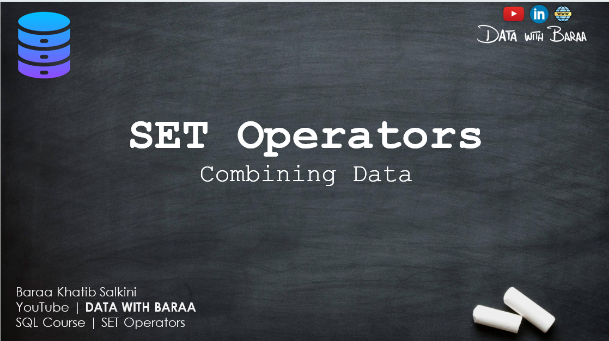
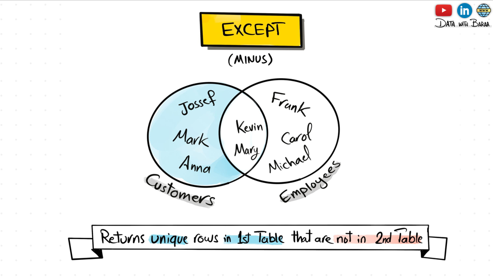
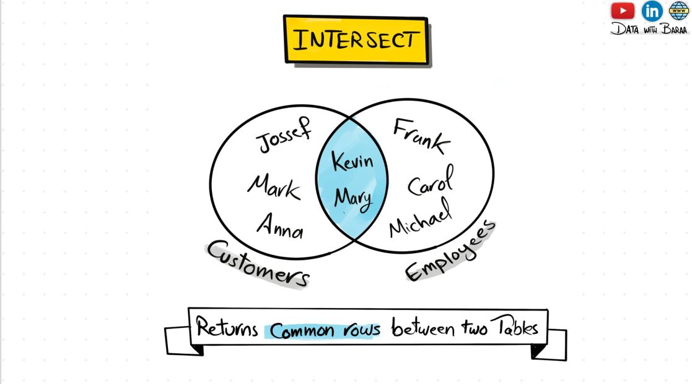

## 🧮 Introduction to SQL Set Operations

Set operations in SQL are used to combine the results of two or more `SELECT` queries. These operations allow you to perform actions similar to mathematical set theory — such as unions, intersections, and differences — directly on database query results.
### 🔍 SET OPERATION

**Example:**
## 🖼️ Overview Image



By mastering set operations, you’ll be able to write more powerful and flexible queries — especially for tasks involving comparison, combination, and filtering across multiple datasets.

### 8. 🔍 UNION 
--combine the data from employees and cutomers into one table

**Example:**
## 🖼️ Overview Image


### 8. 🔍 UNION ALL 
--Returns all  rowS from both queries including duplicate rows 

**Example:**
## 🖼️ Overview Image


### 8. 🔍 EXCEPT 
--Returns all distinct rowS from the first queries that are not found in the second query 

**Example:**
## 🖼️ Overview Image


### 8. 🔍 INTERSECT 
--find the employee who are  customers 

**Example:**
## 🖼️ Overview Image



## 🚀 How to Use

1. Open your SQL IDE (MySQL Workbench, SQLite, pgAdmin, etc.)
2. Clone this repo:
   ```bash
   git clone https://github.com/sdSAHABUDDIN/SQL.git
   cd FILTERING